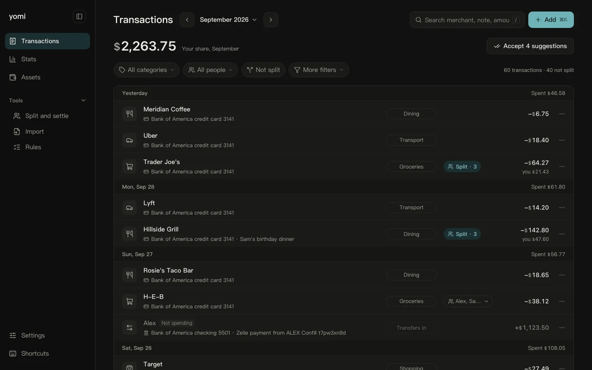

[English](README.md) | **简体中文**

<p align="center">
  <picture>
    <source media="(prefers-color-scheme: dark)" srcset="apps/web/public/brand/wordmark-light.svg">
    
  </picture>
</p>

一个自托管的个人账本，为钱同时在中美两地流动的人而做：支付宝、微信支付、工商银行以及美国各家银行的账单合在一张列表里，和朋友分摊的费用清清楚楚，数据只留在你自己的电脑上。



**状态：** v0.2.2，早期版本，作者本人每天在用。

## 功能

- **账单导入**：支持支付宝 CSV、微信支付 xlsx、工商银行信用卡 PDF 和短信提醒、美国银行 CSV。每个文件导入前都会和它自带的合计核对，每次导入都可以撤销。
- **不重复记账**：在支付宝里出现、又在背后那张卡的账单上出现的同一笔付款只记一次；重复导入同一个文件只会加入新的记录。
- **人民币和美元并行**：每笔金额保留原币种，没有明确的汇率就绝不跨币种相加。
- **分摊与结算**：给记录标上一起分摊的人，按人、按币种看还有多少没结清，再把一份干净的对账单以 PDF、图片或文字发给对方，附上你的收款二维码。
- **银行和券商同步**：通过 Plaid（使用你自己的密钥）和盈透证券 Flex 报表。
- **统计与资产**：任意时间段的分类支出、月度目标、净资产和持仓。
- **快速记账与双语界面**：按 ⌘K 输入 `午饭 35 @Alex` 即可记一笔；界面支持简体中文和英文，浅色和深色主题。

## 快速开始

环境要求：

- [Node.js](https://nodejs.org) 24 或更新版本
- [pnpm](https://pnpm.io) 10（运行 `corepack enable` 会自动使用锁定的版本）
- Git
- macOS、Linux 或 Windows（建议使用 WSL）

不需要另外安装数据库服务器。

```bash
git clone https://github.com/averatec0773/yomi.git
cd yomi
pnpm install
pnpm dev
```

打开 http://localhost:7773 。yomi 会在 `data/pglite/` 创建账本（内嵌的 Postgres，无需另外安装）。然后打开 **导入**，拖入一个账单文件。

想先用虚构数据看看：

```bash
pnpm demo:db
DATABASE_URL=data/demo-pglite pnpm dev
```

以后更新：`git pull && pnpm install && pnpm dev`。启动时会先自动备份，再升级数据库。

## 配置

没有必填项。银行和券商的凭据在 **设置 > 连接** 中填写，加密保存。如果想用文件管理配置，把 [`.env.example`](.env.example) 复制为 `.env.local`；文件里的值优先于设置页面。所有环境变量、账本位置（`DATABASE_URL`，也可以指向 Postgres 服务器）和加密密钥的说明见 [guides/configuration.md](guides/configuration.md)（英文）。

## 指南

以下指南目前只有英文版。

- [日常使用](guides/using-yomi.md)：导入、分摊、对账单、快速记账、更新
- [配置](guides/configuration.md)：数据位置、环境变量、凭据、隐私
- [导入支付宝账单](guides/import-alipay.md)
- [导入微信支付账单](guides/import-wechat.md)
- [导入工商银行信用卡账单](guides/import-icbc.md)
- [导入美国银行 CSV](guides/import-boa.md)
- [用 Plaid 连接银行和券商](guides/plaid.md)
- [连接盈透证券](guides/ibkr.md)
- [在手机上使用 yomi](guides/remote-access.md)
- [备份与恢复](guides/backup-and-restore.md)
- [从 v0.1 升级](guides/upgrade-from-v0.1.md)
- [常见问题](guides/troubleshooting.md)

## 隐私

yomi 是本地优先的：账本、备份和账单文件都留在你的电脑上，没有 yomi 服务器，也没有任何遥测。只有在你使用相应功能时才会联网（Plaid、盈透证券，以及从 Frankfurter 获取每日汇率）。保存的凭据用 AES-256-GCM 加密，密钥存放在代码仓库之外；请把密钥备份到密码管理器里。`pnpm dev` 会在局域网上监听，所以在手机或其他电脑上打开 yomi 之前，请先设置 `YOMI_ACCESS_TOKEN`（[指南](guides/remote-access.md)）。详见 [guides/configuration.md](guides/configuration.md#privacy-and-network-access)。

## 参与贡献

欢迎提交问题报告、新的账单来源和修复。安装、架构和约定请阅读 [CONTRIBUTING.md](CONTRIBUTING.md)。外部贡献需要签署[贡献者许可协议](CLA.md)，第一次提交拉取请求时机器人会请你签署。请不要在问题里附上真实账单或真实数据的截图。

## 许可

- yomi 采用 [GNU Affero 通用公共许可证 v3.0（仅此版本）](LICENSE)（AGPL-3.0-only）。
- `packages/contracts` 采用 [MIT 许可证](packages/contracts/LICENSE)。
- “yomi”及其标志是项目所有者的商标；分发或作为服务提供的派生版本必须使用不同的名称。详见 [TRADEMARK.md](TRADEMARK.md)。
